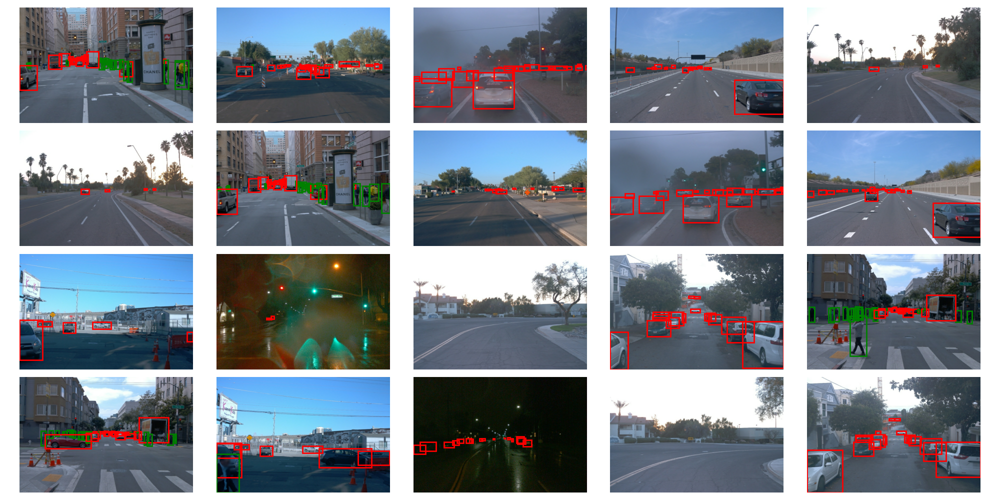

# Bounding Box Visualization

## Objective

This repository contains code to visualize the ground truth boxes on top of images captured from a vehicle's dashboard. The bounding boxes are color-coded to represent their associated class IDs.

## Details

The labels (bounding boxes and classes) are located in the `data/ground_truth.json` file. It contains 20 observations, each represented as a dictionary with the following fields:

```python
{
  "filename": str,
  "boxes": List[List[int]],
  "classes": List[int]
}

The bounding boxes use the '[y1, x1, y2, x2]' format. Images (PNG files) are located in the 'data/images' folder. Each image is associated can be matched with its labels with the filename. 

The 'utils.py' file contains an help function 'get_data' that you can import to load the ground truth and the predictions. You will only need the ground truth for 
this exercise though. 

# How to run
1. Clone the computer_vision repository to your local machine by running this command in your terminal:
```sh
{git clone <repository_url>}
2. Change directory to bounding_box_visualization:
```sh 
{cd bounding_box_visualization}
3. Run the visualization code 
```sh 
{python visualization.py}

## Expected results

If you run the code correctly, you should see the following result:
